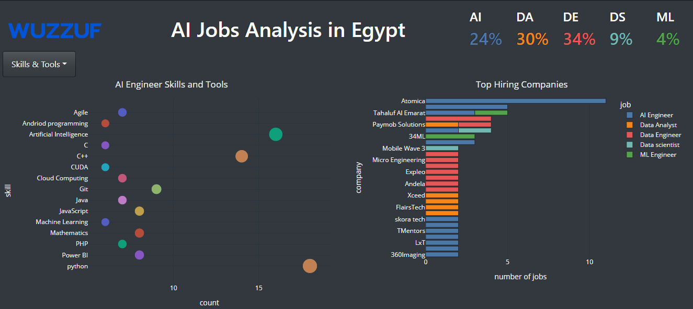
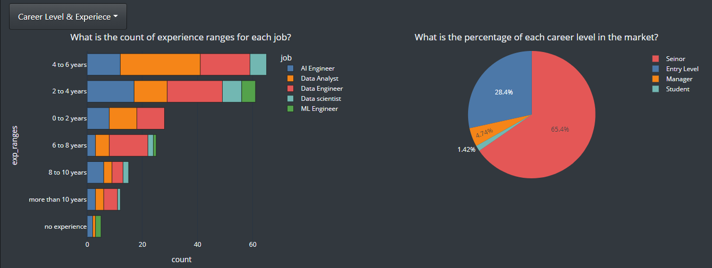

# Jobs_Analysis_DashBoard

## About:
This project is a data visualization project for AI and Data Jobs analysis in Egypt.

## Data source:
we collected the data through web scraping to wuzzuf website.
https://wuzzuf.net/jobs/egypt

## Technologies:

we used the following tools:

- [Selenium](https://selenium-python.readthedocs.io/)
- [requests](https://docs.python-requests.org/en/latest/)
- [BeautifulSoup](https://www.crummy.com/software/BeautifulSoup/bs4/doc/)
- [Pthon](https://www.python.org/)
- [Plotly](https://plotly.com/)
- [Dash](https://dash.plotly.com/)

## Made by:
- <a href="https://github.com/esraasayed98" target="_blank">Esraa Sayed</a>  
- <a href="https://github.com/Mahmoud-shabban" target="_blank">Mahmoud-shabban</a>  
